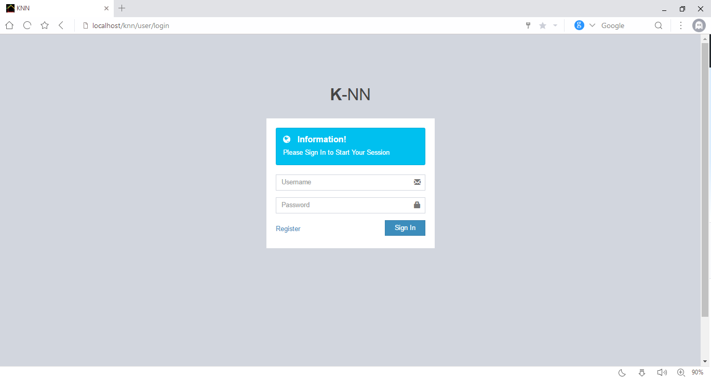
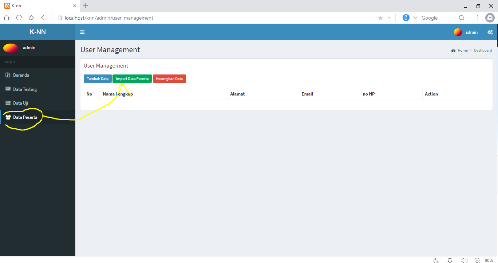
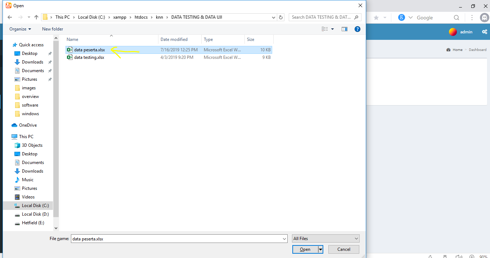
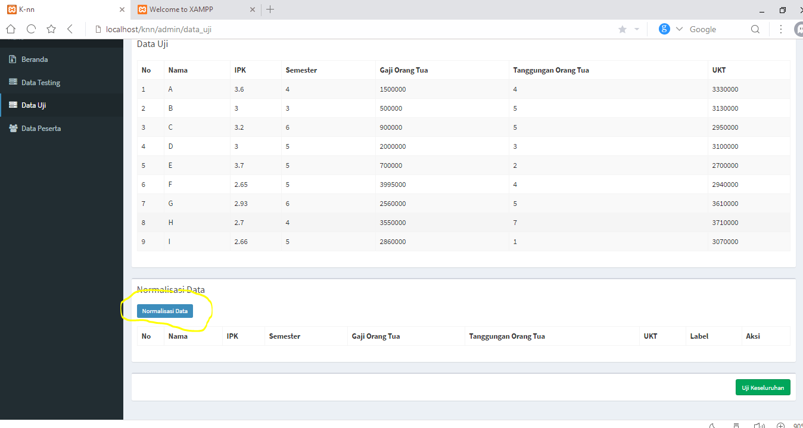
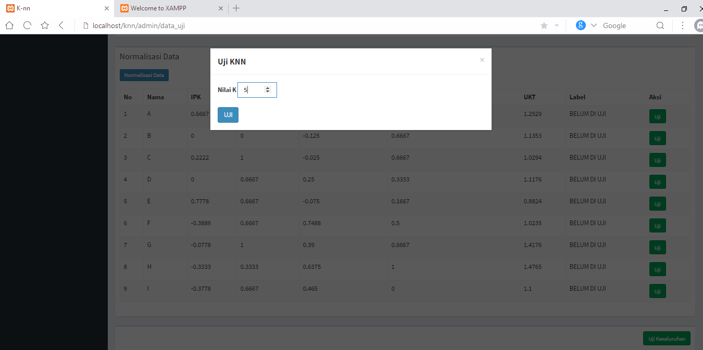
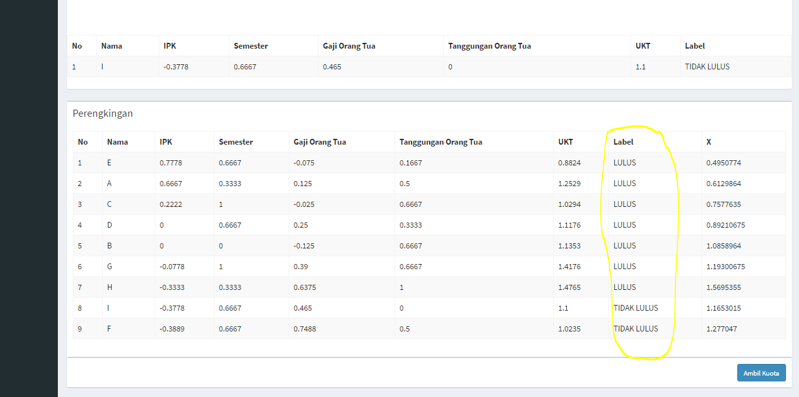

## knn_algorithm

Algoritme k-nearest neighbor (k-NN atau KNN) adalah sebuah metode untuk melakukan klasifikasi terhadap objek berdasarkan data pembelajaran yang jaraknya paling dekat dengan objek tersebut.

Data pembelajaran diproyeksikan ke ruang berdimensi banyak, dimana masing-masing dimensi merepresentasikan fitur dari data. Ruang ini dibagi menjadi bagian-bagian berdasarkan klasifikasi data pembelajaran. Sebuah titik pada ruang ini ditandai kelas c jika kelas c merupakan klasifikasi yang paling banyak ditemui pada k buah tetangga terdekat titk tersebut. Dekat atau jauhnya tetangga biasanya dihitung berdasarkan jarak Euclidean.

Pada fase pembelajaran, algoritme ini hanya melakukan penyimpanan vektor-vektor fitur dan klasifikasi dari data pembelajaran. Pada fase klasifikasi, fitur-fitur yang sama dihitung untuk data test (yang klasifikasinya tidak diketahui). Jarak dari vektor yang baru ini terhadap seluruh vektor data pembelajaran dihitung, dan sejumlah k buah yang paling dekat diambil. Titik yang baru klasifikasinya diprediksikan termasuk pada klasifikasi terbanyak dari titik-titik tersebut.

Nilai k yang terbaik untuk algoritme ini tergantung pada data; secara umumnya, nilai k yang tinggi akan mengurangi efek noise pada klasifikasi, tetapi membuat batasan antara setiap klasifikasi menjadi lebih kabur. Nilai k yang bagus dapat dipilih dengan optimasi parameter, misalnya dengan menggunakan cross-validation. Kasus khusus di mana klasifikasi diprediksikan berdasarkan data pembelajaran yang paling dekat (dengan kata lain, k = 1) disebut algoritme nearest neighbor.

Ketepatan algoritme k-NN ini sangat dipengaruhi oleh ada atau tidaknya fitur-fitur yang tidak relevan, atau jika bobot fitur tersebut tidak setara dengan relevansinya terhadap klasifikasi. Riset terhadap algoritme ini sebagian besar membahas bagaimana memilih dan memberi bobot terhadap fitur, agar performa klasifikasi menjadi lebih baik.

# Penggunaan
1. login dengan menggunakan Username : `root`,  pass : `admin`



2. kli menu data peserta kemudian import data peserta



3. kemudian normalisasi Data uji


4. klik uji data keseluruhan untuk menguji semua data


# hasil


```
//   Kode untuk menghitung jarak 
  private function distance($data_uji, $data_testing )
  {     
        $attrs = array(
            'data_semester', 'data_IPK', 'data_gaji_ortu', 'data_UKT', 'data_tanggungan'
        );
        $value = 0;
        foreach( $attrs as $attr )
        {
            $value+= pow( ( $data_uji[ $attr ] - $data_testing[ $attr ] ), 2 );
        }
        return round( sqrt( $value ), 6 );
  }
}
```
